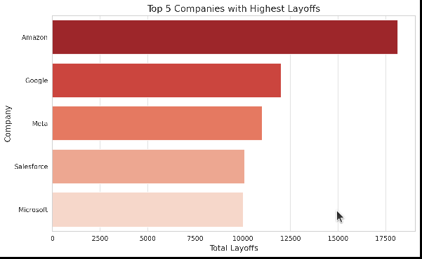
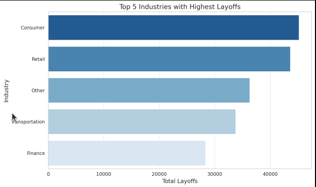
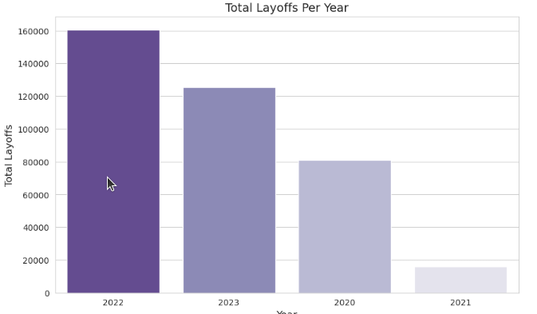

# 📊 Layoffs Exploratory Data Analysis (EDA)

 
 

## 🚀 Introduction
This project focuses on analyzing global layoffs from major companies between 2020 and 2023. Using SQL, I uncovered key trends, industries affected, and companies with significant layoffs.

## 🕵️ Background
Understanding layoffs trends is crucial for businesses and job seekers. This analysis aims to explore:
- Which industries were most affected
- Countries with the highest layoffs
- Companies with significant workforce reductions
- Timeline patterns of layoffs

## 🗄 Dataset
- **Source**: [Kaggle Layoffs Dataset](https://www.kaggle.com/)
- **Time Period**: March 2020 - March 2023
- **Records**: ~2,500 entries +
- **Fields**: Company, location, industry, total laid off, percentage laid off, date, stage, country, funds raised

## 📊 Data Analysis Process
###  Data Preparation

- Created staging tables for data cleaning
- Standardized company names, removed duplicates
   Handled NULL value

### 🔹 Key Findings
#### 🔥 Maximum Layoffs & Highest Layoff Percentage
- Identified the highest total layoffs recorded.
- Determined the maximum percentage of workforce laid off by a single company.

#### 💰 High-Funding Companies with Full Workforce Layoff
- Analyzed companies with 100% workforce reduction.
- Ordered results by funding to see which well-funded companies experienced mass layoffs.

#### 📅 Date Range of Layoffs
- Data spans from **March 22, 2020**, to **March 6, 2023**.
- 
#### 🏢 Companies with the Highest Total Layoffs

- Summed total layoffs per company.
- **Amazon** recorded the highest total layoffs.

#### 🏭 Industries Most Affected

- Aggregated layoffs by industry.
- Consumer-related industries were heavily impacted.

#### 🌎 Countries with the Highest Layoffs
- Summed layoffs by country.
- **United States** saw the most job cuts.

#### 📆 Hardest Year for Layoffs

- 2022 recorded the highest layoffs, showing a major economic downturn.

#### 📈 Monthly Rolling Layoff Totals
- Calculated layoffs per month and cumulative totals.
- Showed peak layoff periods over time.

#### 🏆 Top 5 Companies by Layoffs Per Year
- Ranked companies based on yearly layoffs.
- Used **DENSE_RANK()** to determine top 5 most affected companies per year.

| Year | Rank | Company     | Total Laid Off |
|------|------|-------------|----------------|
| 2020 | 1    | Uber        | 7,525          |
|      | 2    | Booking.com | 4,375          |
|      | 3    | Groupon     | 2,800          |
|      | 4    | Swiggy      | 2,250          |
|      | 5    | Airbnb      | 1,900          |
| 2021 | 1    | Bytedance   | 3,600          |
|      | 2    | Katerra     | 2,434          |
|      | 3    | Zillow      | 2,000          |
|      | 4    | Instacart   | 1,877          |
|      | 5    | WhiteHat Jr | 1,800          |
| 2022 | 1    | Meta        | 11,000         |
|      | 2    | Amazon      | 10,150         |
|      | 3    | Cisco       | 4,100          |
|      | 4    | Peloton     | 4,084          |
|      | 5    | Carvana     | 4,000          |
|      | 5    | Philips     | 4,000          |
| 2023 | 1    | Google      | 12,000         |
|      | 2    | Microsoft   | 10,000         |
|      | 3    | Ericsson    | 8,500          |
|      | 4    | Amazon      | 8,000          |
|      | 4    | Salesforce  | 8,000          |
|      | 5    | Dell        | 6,650          |

## ⚙️ Tools Used
- 🛢 **MySQL Workbench** for SQL queries and data analysis.
- 📂 **Kaggle** for dataset sourcing.

## 📚 Lessons Learned
✔ **Data Challenges**:
- Handling self-reported data inconsistencies
- Dealing with partial reporting (many NULL % values)

✔ **Technical Skills Improved**:
- Complex window functions for running totals
- Advanced date manipulation in SQL
- Data storytelling techniques

## 🔍 Conclusion
This analysis highlights key trends in layoffs across companies, industries, and countries. The data reveals how economic downturns, funding, and industry shifts impact workforce stability.

### 💡 Closing Thoughts
This project provided valuable insights into layoffs over the years. Next steps include integrating visualization tools like Tableau or Power BI to present findings more interactively.
